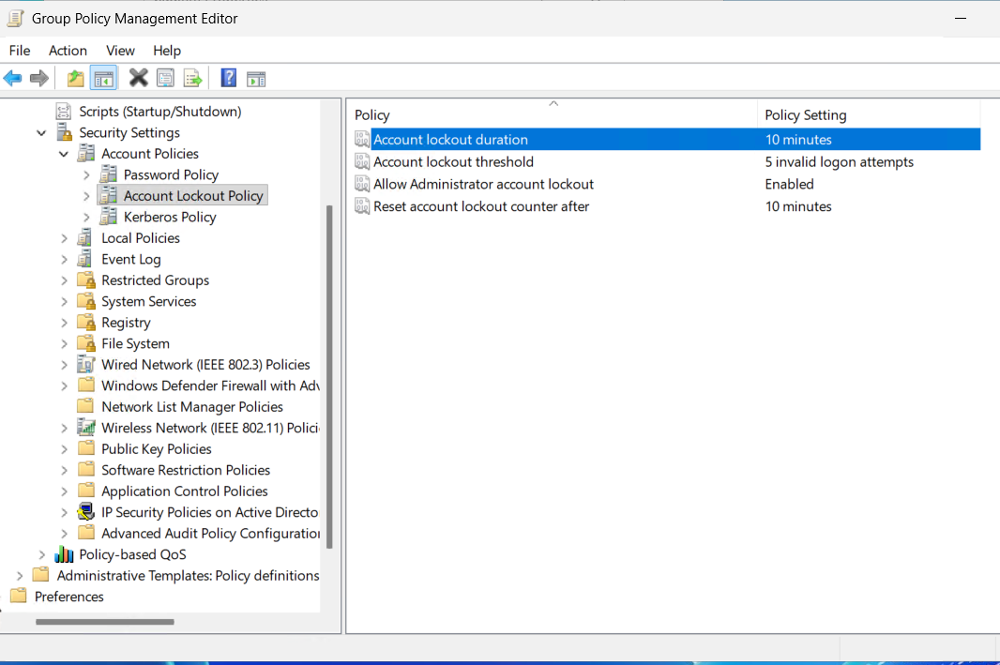
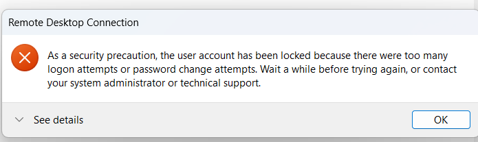
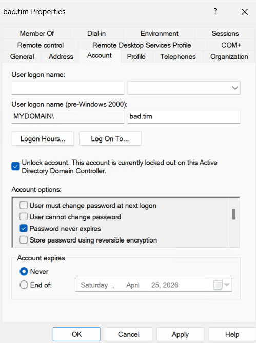
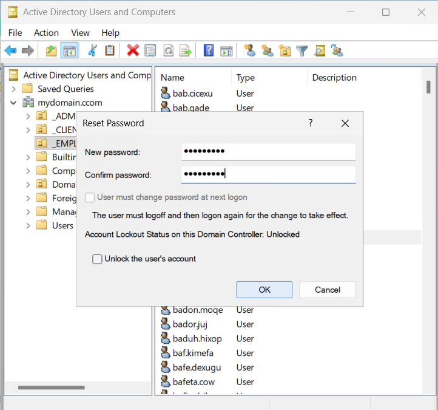
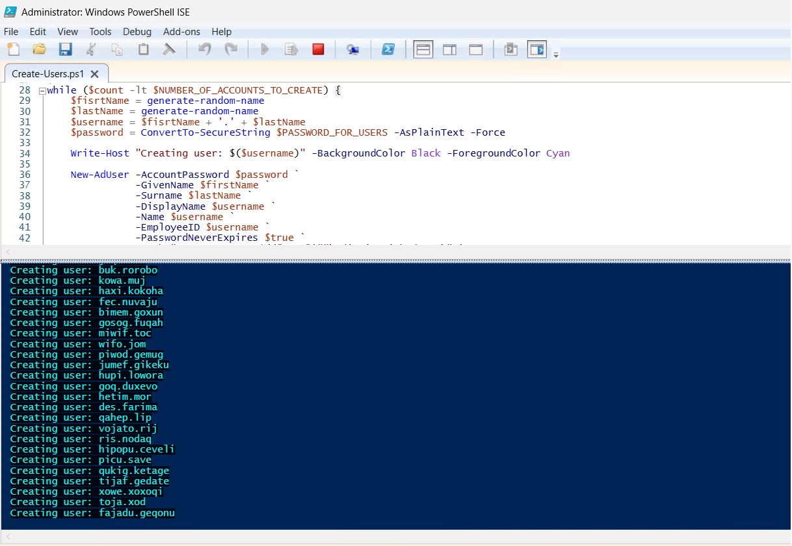
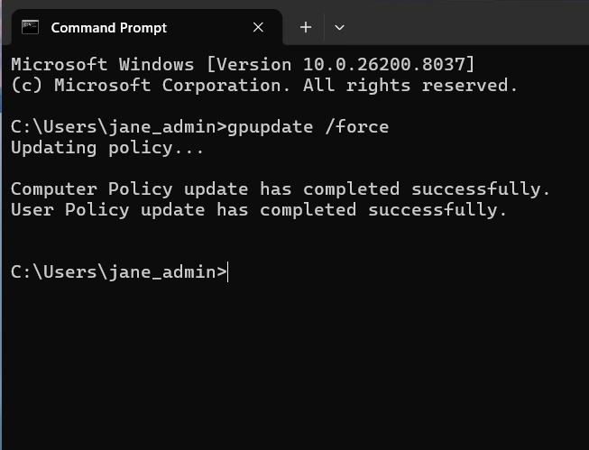
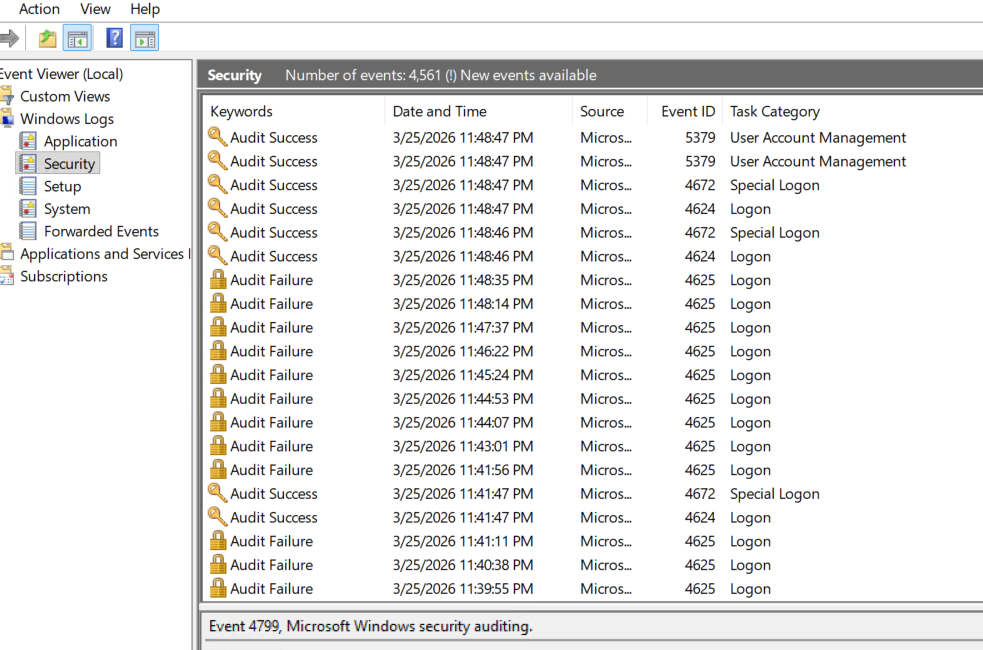

# Active Directory Account Management 
**Account Lockouts, Password Resets, and Security Logging**

# Overview  
This project demonstrates how to manage account lockouts, enforce security policies, and monitor logs is essential in protecting systems from unauthorized access. This highlights my core Identity and Access Management (IAM) skills used in real-world environments, including user lifecycle management and security monitoring.  

## Steps Taken  

1. Logged into DC-1 and selected an existing user account to simulate failed login attempts  

2. Attempted multiple incorrect logins to trigger an account lockout scenario  

3. Configured Group Policy to enforce an account lockout threshold after 5 failed attempts  

4. Verified the account was locked out in Active Directory and proceeded to unlock the account  

5. Reset the user’s password and confirmed successful login after unlocking  

6. Disabled the account, tested login failure, then re-enabled the account and verified access restoration  

7. Forced Group Policy updates using `gpupdate /force` to apply changes across the system  

8. Reviewed security logs on the Domain Controller and client machine to analyze login attempts and account activity  

---

  
   
  <em>Account lockout triggered and login error displayed after multiple failed attempts</em>

  
   
  <em>Unlocking the account and resetting the user password in Active Directory</em>

   
  <em>Password successfully updated confirmation</em>

  
   
  <em>Disabling and re-enabling the user account to control access</em>

  
   
  <em>Viewing users and verifying account changes within Active Directory</em>

   
  <em>Applying Group Policy updates using gpupdate /force</em>

   
  <em>Reviewing security logs to monitor login attempts and account activity</em>

